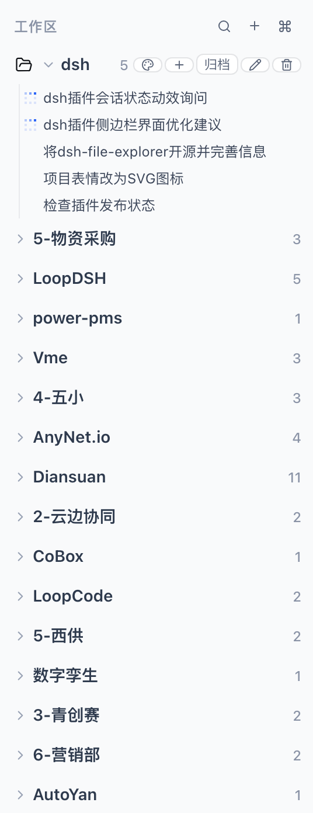
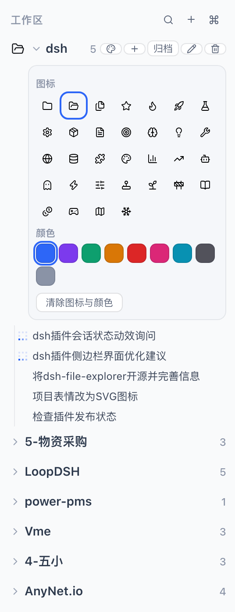
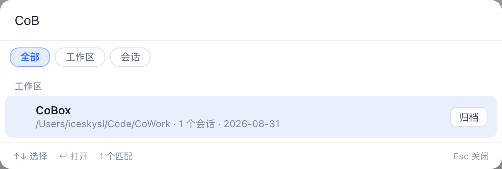

# dsh-workspace-kit

> GitHub: <https://github.com/ice5kysl/dsh-workspace-kit> ｜ MIT License ｜ Target dsh: `@deepseek-ai/dsh` ≥ 0.1.1-rc.2 ｜ English · [简体中文](./README.zh-CN.md)

A **dsh (DeepSeek Harness) plugin** written to official conventions, in the Cordis "bundle" form. It solves two pain points:

1. **Too many workspaces, hard to find** → **⌘K / Ctrl+K Spotlight search**: fuzzy-search all workspaces and sessions (including ungrouped and archived ones), navigate with ↑↓ and press Enter to **open / jump** directly.
2. **Want to archive old workspaces** → **soft archive** (hidden + restorable, no data deleted):
   - **Built-in sidebar**: the plugin registers into the `sidebar.workspaces` slot at low priority (-1), **replacing the shipped workspace browser** — archived workspaces leave the "Workspaces" list and move into a collapsible "Archived (N)" section where you can restore / open / start a new session; ungrouped sessions live in their own section too.
   - **Spotlight**: the idle list hides archived items; when you type, matching archived items appear with an "Archived" badge so you can locate and restore them.
   - Archive / restore is also available on every sidebar row and Spotlight result.

The plugin ships **two faces** carried by a single Loader entry (`dsh-workspace-kit`):

| Face | File | Responsibility |
|---|---|---|
| Host (node) | `lib/index.js` | `workspace_find` / `workspace_list` model tools; `/workspace-find`, `/workspace-list` slash commands (read-only lookup; write actions stay in the GUI) |
| Browser (client) | `lib/client.js` | Spotlight palette (registered into the official, otherwise-empty `shell.overlay` slot) + soft-archive store (localStorage-persisted) + enhanced sidebar browser |

> Design rationale: dsh's official model only has **session-level** (irreversible) archiving and the shipped sidebar browser has no per-row hide seam, so this plugin takes a "**view-layer soft archive** + **shadow the sidebar browser**" approach: archive state is managed by the plugin (browser-persisted) and, by shadowing `sidebar.workspaces` with its own browser that carries the collapsible "Archived" section, archived workspaces truly leave the main sidebar list. The v1 capability boundary of the replacement browser is documented in [known-limitations.md](./docs/known-limitations.md).

Beyond archive/restore, the enhanced sidebar (when active) adds:

- **New workspace** (the plus button next to search) — system directory picker → register → open.
- **Sidebar search** (expandable input) — filter workspaces/sessions by title and path, plus **full-text session-content search** (≥2 chars, debounced, via the official host content index).
- **Per-workspace icon + accent color** — hover a row and click the palette button (or the icon itself); 32 SVG icons + 9 colors, "clear" to reset; Spotlight results show the same look (browser-persisted).
- **Drag reorder** — drag workspace rows → official `insertBefore`; drag sessions within their workspace → `insertSessionBefore`; once a workspace is manually dragged its sessions switch to the manual (account) order, matching the shipped Manual semantics.
- **Styled dialogs** — rename / delete / archive confirmations use in-app styled dialogs instead of `prompt`/`confirm`.
- **One-click sidebar toggle** — a footer button switches between the enhanced sidebar and the official sidebar instantly; the choice persists across restarts.

You can also say things like "use `workspace_find` to find the pms workspace" in a session, or type `/workspace-find pms`.

## Screenshots

| Enhanced workspace sidebar | Per-workspace icon & color picker | ⌘K Spotlight search |
| :---: | :---: | :---: |
|  |  |  |

## Languages (i18n)

All user-facing copy is bilingual (Simplified Chinese / English):

- **Browser (client)**: locale is resolved from the `localStorage` key `dsh.workspace-kit.locale` (`zh` | `en`) when set, otherwise from `navigator.language(s)` (`zh*` → Chinese, anything else → English).
- **Host (node)**: locale is resolved from the `WSKIT_LOCALE` environment variable (`zh` | `en`) when set, otherwise from `LC_ALL` / `LANG` (`zh*` → Chinese), defaulting to English.
- Translations live at the call site via an `L('中文', 'English', vars?)` helper backed by `src/shared/i18n.ts`; see the per-side `src/client/locale.ts` and `src/host/locale.ts` for detection.

## Quick install (personal dsh)

Published on npm — if you already run dsh Web, install in one line:

```bash
dsh plugin --profile web add dsh-workspace-kit
```

The git route below is for development / running the latest source.

Prerequisites: `dsh` on PATH (`@deepseek-ai/dsh` ≥ 0.1.1-rc.2), Node 20+.

```bash
# 0. Get the source (or use a local directory)
git clone https://github.com/ice5kysl/dsh-workspace-kit && cd dsh-workspace-kit

# 1. Build (produces lib/index.js + lib/client.js; the prepare hook of
#    npm install already runs the build for you)
npm install                # installs build-time deps (typescript/esbuild/@types …)
npm run build

# 2. Install into your web profile (equivalent to the official `dsh plugin add`)
bash scripts/install-personal.sh
#    The script locates this directory itself and runs
#    `dsh plugin --profile web add .`, which appends the package to
#    `dsh.profile.bundles` in ~/.dsh/profiles/web (after dsh-web-app) and
#    lets the in-package cordis.patch.yml insert the single Loader row.

# 3. Verify the composition (no restart needed)
dsh --profile web --dump-config | grep -n "workspace-kit"

# 4. Restart the GUI to activate
#    Quit the current dsh web (Ctrl+C or kill the process), run `dsh web`
#    again, then refresh the browser at http://127.0.0.1:3080
```

> Also usable as a monorepo subdirectory (e.g. `plugins/dsh-workspace-kit`): the install script walks up from `package.json` to find the plugin directory, so both layouts need no command changes.

## Package / distribute (optional)

```bash
npm pack          # produces dsh-workspace-kit-0.1.0.tgz (prebuilt lib/; prepack builds automatically)
# Other machine: dsh plugin --profile web add ./dsh-workspace-kit-0.1.0.tgz
```

## Development

```bash
npm run typecheck   # tsc --noEmit (host + client sources)
npm run build       # esbuild: src/host → lib/index.js; src/client → lib/client.js
```

Source layout:

```
src/host/      Host side: locale.ts (env-based locale), util.ts (search/list pure
               functions), tools.ts (model tools), commands.ts (slash commands),
               index.ts (apply: registers per service availability)
src/client/    Browser side: locale.ts (navigator-based locale), archive-store.ts
               (defineStore soft-archive set + appearance, persist localStorage),
               dialogs.tsx, SidebarToggle.tsx, Spotlight.tsx (⌘K palette),
               WorkspaceSidebar.tsx, index.ts (apply: slot registrations + closures)
src/shared/    i18n.ts (pure locale helpers shared by both faces)
cordis.patch.yml    bundle layer: inserts the single Loader entry `dsh-workspace-kit`
```

## How it works / design notes (based on official docs & source)

- Plugin shape = a **bundle package** (`dsh.bundle.patch`) + a **browser face** (`dsh.client.platform: 'web'` + the `./client` export). The host scans enabled Loader entries; one package provides both the node and the browser side from the same entry, and **one package may only have one entry** (multiple entries resolving to the same package name are rejected by the client module system).
- Spotlight mounts into **`shell.overlay` (list/root)** — the official slot reserved for whole-window custom overlays. The sidebar registers into **`sidebar.workspaces` (single/root)** at **priority -1** to shadow the built-in occupant (lower priority renders; only equal priorities conflict) — the officially allowed "full replacement" route, at the cost of re-implementing some built-in browser capabilities yourself (see known-limitations).
- Data is read through the framework's standard hooks (`useWorkspaces` / `useSessions` / `useStore`); actions go through registered `inject` closures that call the official session service: `ctx.workspaces.startSession(workspaceId)` (reuse/create and open that workspace's session) and `ctx.sessions.open(id)`.
- The archive set uses the framework's `defineStore` + `persist` (bare JSON in localStorage under `dsh.workspace-kit.archive.v1`), the same mechanism as built-in view preferences (e.g. `dsh.workspace.view.v5`).
- There is no official registration API for global hotkeys (no keyboard service anywhere in the repo), so, following the convention of built-in plugins, a `window` keydown listener is attached (⌘K/Ctrl+K); the palette stays mounted and renders `null` while closed to keep the listener alive.
- The host side is deliberately **read-only**: archive semantics are view-layer (browser) state; keeping a second copy host-side would drift from the GUI, so it is intentionally not written.

## Compatibility

- Target dsh: `@deepseek-ai/dsh` v0.1.1-rc.2 (`dsh web`, profile `web`). The browser face targets that release's `shell.overlay` / `IWorkspaces` / `ISessions` contracts; re-validate against the upstream contract on version upgrades.
- Known limitations and the backlog are tracked in [docs/known-limitations.md](./docs/known-limitations.md) (中文版见 [docs/known-limitations.zh-CN.md](./docs/known-limitations.zh-CN.md)).

## License

[MIT](./LICENSE)
